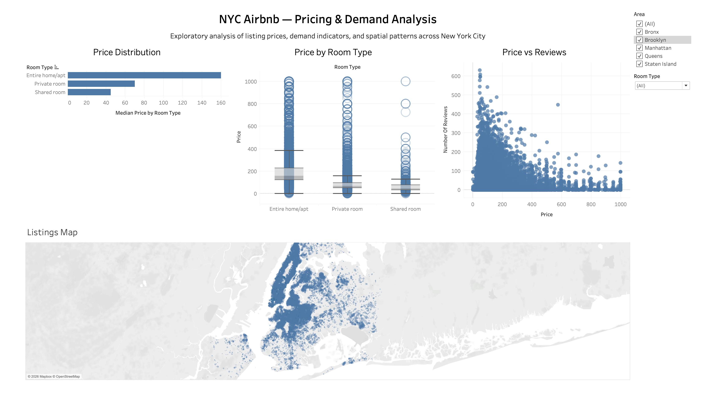

# NYC Airbnb — Pricing & Demand Analysis (Tableau)

This project analyzes Airbnb listings in New York City to understand pricing patterns, demand indicators, and geographic distribution using Tableau.

## 🎯 Project Objective
The goal of this analysis is to:
- Understand how prices are distributed across different room types
- Examine the relationship between price and demand (number of reviews)
- Identify spatial patterns of listings across NYC boroughs

## 📊 Dashboard Overview
The interactive dashboard includes:
- Price distribution analysis
- Price comparison by room type
- Price vs number of reviews
- Availability vs price
- Geographic distribution of listings (map)

## 🛠 Tools & Technologies
- Tableau Public
- CSV dataset (Airbnb NYC Open Dataset)
- Exploratory Data Analysis (EDA)

## 📂 Dataset
- Source: Airbnb NYC Open Dataset (2019)  
- Link: https://www.kaggle.com/datasets/dgomonov/new-york-city-airbnb-open-data

## 🔗 Tableau Public Dashboard
https://public.tableau.com/views/NYCAirbnbPricingDemandAnalysis/Dashboard1?:language=en-US&:sid=&:redirect=auth&:display_count=n&:origin=viz_share_link

## 📌 Key Insight
Lower-priced listings tend to receive more reviews, while higher-priced listings are more concentrated in central areas such as Manhattan.

